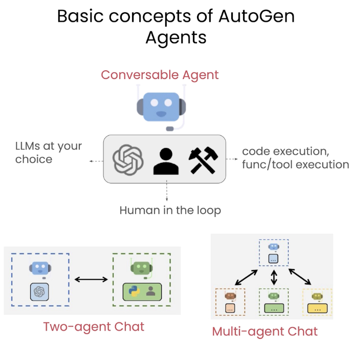

# Multi-agent Conversation

## Conversable agent

`ConversableAgent` is the building agent class of AutoGen that is used to construct multi-agent conversations.



This unifies different types of agents into a single interface that provides basic functionality:

- error and configuration to generate replies
- code execution
- command utilities to allow human interaction
- checking for stop signals
- ability to be turned on and off
- customizability to meet the needs of our application

```python
from utils import get_openai_api_key
OPENAI_API_KEY = get_openai_api_key()
llm_config = {"model": "gpt-3.5-turbo"}
```

> The key and configuration is provided by the course.

We can initialize an agent with the `ConversableAgent` class. We can also define configuration for code execution, function execution, and more.

```python
from autogen import ConversableAgent

agent = ConversableAgent(
    name="chatbot",
    llm_config=llm_config, # defined above.
    human_input_mode="NEVER", # "ALWAYS" will cause the agent to always ask for human input before replying.
)
```

Then, we can ask for a reply to some messages with `ConversableAgent::generate_reply(self)`.

```python
reply = agent.generate_reply(
  messages=[{"content": "Tell me a joke.", "role": "user"}]
)
print(reply)
```

```
Sure! Here's one for you:

Why don’t scientists trust atoms?

Because they make up everything!
```

If we run the function again, we'll notice that there's no context or memory. That's because `ConversableAgent::generate_reply(self)` does not alter the internal state of the agent.

```python
reply = agent.generate_reply(
    messages=[{"content": "Repeat the joke.", "role": "user"}]
)
print(reply)
```

```
Of course! Please provide me with the joke you'd like me to repeat.
```

If we want to maintain state or memory, we have to use a different approach.

## Conversation

Set up two agents where the memory of their interactions is retained.

```python
cathy = ConversableAgent(
    name="cathy",
    system_message=
    "Your name is Cathy and you are a stand-up comedian.",
    llm_config=llm_config,
    human_input_mode="NEVER",
)

joe = ConversableAgent(
    name="joe",
    system_message=
    "Your name is Joe and you are a stand-up comedian. "
    "Start the next joke from the punchline of the previous joke.",
    llm_config=llm_config,
    human_input_mode="NEVER",
)
```

System messages are used to configure the agent's persona or behaviour. Without it defined, the agent will act as a default non-descriptive entity.

To initialize a conversation, call `ConversableAgent::initiate_chat(self)` from one of the agents. We have to specify:

1. the recipient agent for the conversation,
2. the initial message, and
3. the maximum number of turns.

```python
chat_result = joe.initiate_chat(
    recipient=cathy,
    message="I'm Joe. Cathy, let's keep the jokes rolling.",
    max_turns=2,
)
```

```
joe (to cathy):

I'm Joe. Cathy, let's keep the jokes rolling.

--------------------------------------------------------------------------------
cathy (to joe):

Hey Joe! Why did the math book look sad?

Because it had too many problems.

--------------------------------------------------------------------------------
joe (to cathy):

Well Cathy, at least the math book didn't have commitment issues like my ex-girlfriend!

--------------------------------------------------------------------------------
cathy (to joe):

Haha, sounds like your ex-girlfriend left you counting your losses! But hey, at least math doesn't ghost you, right?

--------------------------------------------------------------------------------
```

Note that the conversation is automatically piped to `stdout`.

We can print out the chat history, cost, and summary of the conversation.

```python
from pprint import pprint

pprint(chat_result.chat_history)
pprint(chat_result.cost)
pprint(chat_result.summary)
```

```
[{'content': "I'm Joe. Cathy, let's keep the jokes rolling.",
  'role': 'assistant'},
 {'content': 'Hey Joe! Why did the math book look sad?\n'
             '\n'
             'Because it had too many problems.',
  'role': 'user'},
 {'content': "Well Cathy, at least the math book didn't have commitment issues "
             'like my ex-girlfriend!',
  'role': 'assistant'},
 {'content': 'Haha, sounds like your ex-girlfriend left you counting your '
             "losses! But hey, at least math doesn't ghost you, right?",
  'role': 'user'}]

{'usage_excluding_cached_inference': {'gpt-3.5-turbo-0125': {'completion_tokens': 65,
                                                             'cost': 0.0001915,
                                                             'prompt_tokens': 188,
                                                             'total_tokens': 253},
                                      'total_cost': 0.0001915}},
 'usage_including_cached_inference': {'gpt-3.5-turbo-0125': {'completion_tokens': 65,
                                                             'cost': 0.0001915,
                                                             'prompt_tokens': 188,
                                                             'total_tokens': 253},
                                      'total_cost': 0.0001915}}

('Haha, sounds like your ex-girlfriend left you counting your losses! But hey, '
 "at least math doesn't ghost you, right?")
```

By default, the last message of the conversation is treated as the conversation summary, but we can also define better summary methods.

```python
chat_result = joe.initiate_chat(
    cathy,
    message="I'm Joe. Cathy, let's keep the jokes rolling.",
    max_turns=2,
    summary_method="reflection_with_llm",
    summary_prompt="Summarize the conversation",
)
pprint(chat_result.summary)
```

```
("Math books may have too many problems, but at least they don't have "
 'commitment issues like some ex-girlfriends.')
```

## Chat termination

If we don't know the right number of maximum turns to set, an alternative is to specify a termination condition instead.

`is_termination_msg` is a predicate function on messages that returns `True` if and only if a message should terminate the agent's conversation.

```python
cathy = ConversableAgent(
    name="cathy",
    system_message=
    "Your name is Cathy and you are a stand-up comedian. "
    "When you're ready to end the conversation, say 'I gotta go'.",
    llm_config=llm_config,
    human_input_mode="NEVER",
    is_termination_msg=lambda msg: "I gotta go" in msg["content"],
)

joe = ConversableAgent(
    name="joe",
    system_message=
    "Your name is Joe and you are a stand-up comedian. "
    "When you're ready to end the conversation, say 'I gotta go'.",
    llm_config=llm_config,
    human_input_mode="NEVER",
    is_termination_msg=lambda msg: "I gotta go" in msg["content"] or "Goodbye" in msg["content"],
)

chat_result = joe.initiate_chat(
    recipient=cathy,
    message="I'm Joe. Cathy, let's keep the jokes rolling."
)
```

```
joe (to cathy):

I'm Joe. Cathy, let's keep the jokes rolling.

--------------------------------------------------------------------------------
cathy (to joe):

Hey Joe! Why did the scarecrow win an award? Because he was outstanding in his field!

--------------------------------------------------------------------------------
joe (to cathy):

Haha, that's a classic one, Cathy! It's all about that stand-out performance.

--------------------------------------------------------------------------------
cathy (to joe):

Thanks, Joe! I always strive to deliver some a-maize-ing jokes!

--------------------------------------------------------------------------------
joe (to cathy):

Haha, love the corny puns, Cathy! You definitely know how to make 'em pop.

--------------------------------------------------------------------------------
cathy (to joe):

Thanks, Joe! I'm just trying to butter you up with some jokes!

--------------------------------------------------------------------------------
joe (to cathy):

Haha, you're really shelling out the puns tonight, Cathy! Let's keep the laughter stalks high!

--------------------------------------------------------------------------------
cathy (to joe):

I'll keep the jokes coming, Joe! Can't stop, won't stop with the corny puns!

--------------------------------------------------------------------------------
joe (to cathy):

Haha, can't wait to hear more, Cathy! You're on a roll!

--------------------------------------------------------------------------------
cathy (to joe):

Thanks, Joe! I'm just trying to husk you up with laughter!

--------------------------------------------------------------------------------
joe (to cathy):

Haha, you're husking me up with so much laughter, Cathy! Your jokes are a-maize-ing!

--------------------------------------------------------------------------------
cathy (to joe):

I'm glad you're enjoying them, Joe! Just trying to spread some kernel of joy!

--------------------------------------------------------------------------------
joe (to cathy):

You're definitely spreading the joy, Cathy! Keep those kernels of laughter popping!

--------------------------------------------------------------------------------
cathy (to joe):

I'll keep the laughter popping, Joe! Just trying to make sure we have a corn-y good time!

--------------------------------------------------------------------------------
joe (to cathy):

Haha, I'm loving the corn puns, Cathy! This conversation is definitely poppin'!

--------------------------------------------------------------------------------
cathy (to joe):

Glad you're enjoying it, Joe! I always try to bring some pop to the party!

--------------------------------------------------------------------------------
joe (to cathy):

You're definitely bringing the pop, Cathy! This party is corn-tastic with your jokes!

--------------------------------------------------------------------------------
cathy (to joe):

Haha, thanks, Joe! It's always a-maize-ing to hear that my jokes are poppin'!

--------------------------------------------------------------------------------
joe (to cathy):

Your jokes are definitely poppin', Cathy! Keep 'em coming! But hey, I gotta go. It's been a-maize-ing chatting with you!
```

When an agent (joe) ends its conversation, the other agent (cathy) will not respond.

Conversations started with `initiate_chat` will preserve memory, and we can ask either agent to remember parts of the conversation with `ConversableAgent::send(self)`.

```python
cathy.send(message="What's last joke we talked about?", recipient=joe)
```

```
cathy (to joe):

What's last joke we talked about?

--------------------------------------------------------------------------------
joe (to cathy):

The last joke we talked about was how it's a-maize-ing to hear that your jokes are poppin'!

--------------------------------------------------------------------------------
cathy (to joe):

Thanks for the reminder! I gotta go. It's been a-maize-ing chatting with you too, Joe! Catch you later!

--------------------------------------------------------------------------------
```
