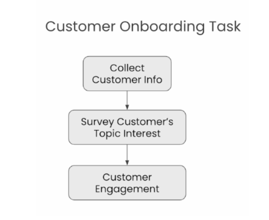
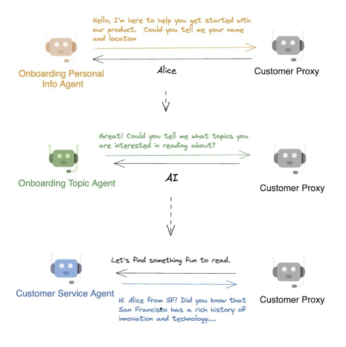

# Sequential Chats

Sequential chats are useful for tasks that comprise multiple sequential stages. For example, it's often easier to ingest context and information from the user sequentially.

```python
llm_config={"model": "gpt-3.5-turbo"}
from autogen import ConversableAgent
```

We'll learn how to use multiple agents that collaborate to provide richer experiences for end-users.

We'll also learn how to integrate human interactions into the conversations using a user proxy agent.

## Creating the agents for this lesson

We want to build a sequential chat that handles the following customer experience:



### Agents for each task

Roughly, we can model this task flow with three agents.

```python
onboarding_personal_information_agent = ConversableAgent(
    name="Onboarding Personal Information Agent",
    system_message='''You are a helpful customer onboarding agent,
    you are here to help new customers get started with our product.
    Your job is to gather customer's name and location.
    Do not ask for other information. Return 'TERMINATE'
    when you have gathered all the information.''',
    llm_config=llm_config,
    code_execution_config=False,
    human_input_mode="NEVER",
)

onboarding_topic_preference_agent = ConversableAgent(
    name="Onboarding Topic preference Agent",
    system_message='''You are a helpful customer onboarding agent,
    you are here to help new customers get started with our product.
    Your job is to gather customer's preferences on news topics.
    Do not ask for other information.
    Return 'TERMINATE' when you have gathered all the information.''',
    llm_config=llm_config,
    code_execution_config=False,
    human_input_mode="NEVER",
)

customer_engagement_agent = ConversableAgent(
    name="Customer Engagement Agent",
    system_message='''You are a helpful customer service agent
    here to provide fun for the customer based on the user's
    personal information and topic preferences.
    This could include fun facts, jokes, or interesting stories.
    Make sure to make it engaging and fun!
    Return 'TERMINATE' when you are done.''',
    llm_config=llm_config,
    code_execution_config=False,
    human_input_mode="NEVER",
    is_termination_msg=lambda msg: "terminate" in msg.get("content").lower(),
)
```



### User interaction proxy

We also need a proxy agent that interacts with the real customer. This agent sets `human_input_mode="ALWAYS"` to solicit input from the user.

```python
customer_proxy_agent = ConversableAgent(
    name="customer_proxy_agent",
    llm_config=False,
    code_execution_config=False,
    human_input_mode="ALWAYS",
    is_termination_msg=lambda msg: "terminate" in msg.get("content").lower(),
)
```

## Creating the chat sequence

Now, we can craft a series of tasks to facilitate the onboarding process.

For the onboarding flow, each chat is effectively a two-agent chat between a particular onboarding agent and the user proxy agent. Each chat sends an initial message to the user proxy to kick off the conversation, then the agents will have a back-and-forth until `max_turns` is reached or the termination message is received.

In a sequential chat scenario, tasks depend on one another. To pass information between agents, we use the summary method.

```python
chats = [
    {
        "sender": onboarding_personal_information_agent,
        "recipient": customer_proxy_agent,
        "message":
            "Hello, I'm here to help you get started with our product."
            "Could you tell me your name and location?",
        # This summary will be passed to the next agent.
        "summary_method": "reflection_with_llm",
        # We can customize the format of the summary for the next agent.
        "summary_args": {
            "summary_prompt" : "Return the customer information "
                             "into as JSON object only: "
                             "{'name': '', 'location': ''}",
        },
        "max_turns": 2,
        "clear_history" : True
    },
    {
        "sender": onboarding_topic_preference_agent,
        "recipient": customer_proxy_agent,
        "message":
                "Great! Could you tell me what topics you are "
                "interested in reading about?",
        "summary_method": "reflection_with_llm",
        "max_turns": 1,
        # By default, history is cleared for the customer_proxy_agent because it appears more than once.
        # To retain chat history, we explicitly configure history to not be cleared in this context.
        "clear_history" : False
    },
    {
        # In this chat, the user proxy agent is the one to initiate the chat with a predefined message.
        "sender": customer_proxy_agent,
        "recipient": customer_engagement_agent,
        "message": "Let's find something fun to read.",
        "max_turns": 1,
        "summary_method": "reflection_with_llm",
    },
]
```

## Starting the onboarding process

Instead of calling `ConversableAgent::initiate_chat(self)`, we use `autogen::initiate_chats` to start the sequence of chats. Each chat in the sequence is initiated when the previous chat terminates.

```python
from autogen import initiate_chats

chat_results = initiate_chats(chats)
```

```
********************************************************************************
Starting a new chat....

********************************************************************************
Onboarding Personal Information Agent (to customer_proxy_agent):

Hello, I'm here to help you get started with our product.Could you tell me your name and location?

--------------------------------------------------------------------------------
Provide feedback to Onboarding Personal Information Agent. Press enter to skip and use auto-reply, or type 'exit' to end the conversation: Bryan, Singapore
customer_proxy_agent (to Onboarding Personal Information Agent):

Bryan, Singapore

--------------------------------------------------------------------------------
Onboarding Personal Information Agent (to customer_proxy_agent):

Thank you, Bryan. Could you please provide me with your location as well?

--------------------------------------------------------------------------------
Provide feedback to Onboarding Personal Information Agent. Press enter to skip and use auto-reply, or type 'exit' to end the conversation: Singapore is my location, Bryan is my name.
customer_proxy_agent (to Onboarding Personal Information Agent):

Singapore is my location, Bryan is my name.

--------------------------------------------------------------------------------

********************************************************************************
Starting a new chat....

********************************************************************************
Onboarding Topic preference Agent (to customer_proxy_agent):

Great! Could you tell me what topics you are interested in reading about?
Context:
{
  "name": "Bryan",
  "location": "Singapore"
}

--------------------------------------------------------------------------------
Provide feedback to Onboarding Topic preference Agent. Press enter to skip and use auto-reply, or type 'exit' to end the conversation: I want to know more about the Scala programming language.
customer_proxy_agent (to Onboarding Topic preference Agent):

I want to know more about the Scala programming language.

--------------------------------------------------------------------------------

********************************************************************************
Starting a new chat....

********************************************************************************
customer_proxy_agent (to Customer Engagement Agent):

Let's find something fun to read.
Context:
{
  "name": "Bryan",
  "location": "Singapore"
}
Bryan is interested in reading about the Scala programming language.

--------------------------------------------------------------------------------
Customer Engagement Agent (to customer_proxy_agent):

Hey Bryan from Singapore! 🇸🇬 How about we delve into a fun fact about the Scala programming language?

Did you know that the name "Scala" stands for "**scalable language**"? It is designed to grow with the demands of its users. Pretty cool, right?

If you want to know more fun facts or have any specific questions about Scala, feel free to ask! Let's make learning about programming as fun as possible! 🚀

TERMINATE

--------------------------------------------------------------------------------
```

## Viewing the summary for each sequential chat stage

```python
from pprint import pprint

for chat_result in chat_results:
    pprint(chat_result.summary)
```

```
'{\n  "name": "Bryan",\n  "location": "Singapore"\n}'
'Bryan is interested in reading about the Scala programming language.'
('Bryan from Singapore is interested in reading about the Scala programming '
 'language, which is known as a "scalable language" designed to grow with user '
 'demands.')
```

```python
for chat_result in chat_results:
    pprint(chat_result.cost)
```

```
{'usage_excluding_cached_inference': {'gpt-3.5-turbo-0125': {'completion_tokens': 33,
                                                             'cost': 0.0001475,
                                                             'prompt_tokens': 196,
                                                             'total_tokens': 229},
                                      'total_cost': 0.0001475},
 'usage_including_cached_inference': {'gpt-3.5-turbo-0125': {'completion_tokens': 33,
                                                             'cost': 0.0001475,
                                                             'prompt_tokens': 196,
                                                             'total_tokens': 229},
                                      'total_cost': 0.0001475}}
{'usage_excluding_cached_inference': {'gpt-3.5-turbo-0125': {'completion_tokens': 12,
                                                             'cost': 5.6500000000000005e-05,
                                                             'prompt_tokens': 77,
                                                             'total_tokens': 89},
                                      'total_cost': 5.6500000000000005e-05},
 'usage_including_cached_inference': {'gpt-3.5-turbo-0125': {'completion_tokens': 12,
                                                             'cost': 5.6500000000000005e-05,
                                                             'prompt_tokens': 77,
                                                             'total_tokens': 89},
                                      'total_cost': 5.6500000000000005e-05}}
{'usage_excluding_cached_inference': {'gpt-3.5-turbo-0125': {'completion_tokens': 130,
                                                             'cost': 0.0003375,
                                                             'prompt_tokens': 285,
                                                             'total_tokens': 415},
                                      'total_cost': 0.0003375},
 'usage_including_cached_inference': {'gpt-3.5-turbo-0125': {'completion_tokens': 130,
                                                             'cost': 0.0003375,
                                                             'prompt_tokens': 285,
                                                             'total_tokens': 415},
                                      'total_cost': 0.0003375}}
```
